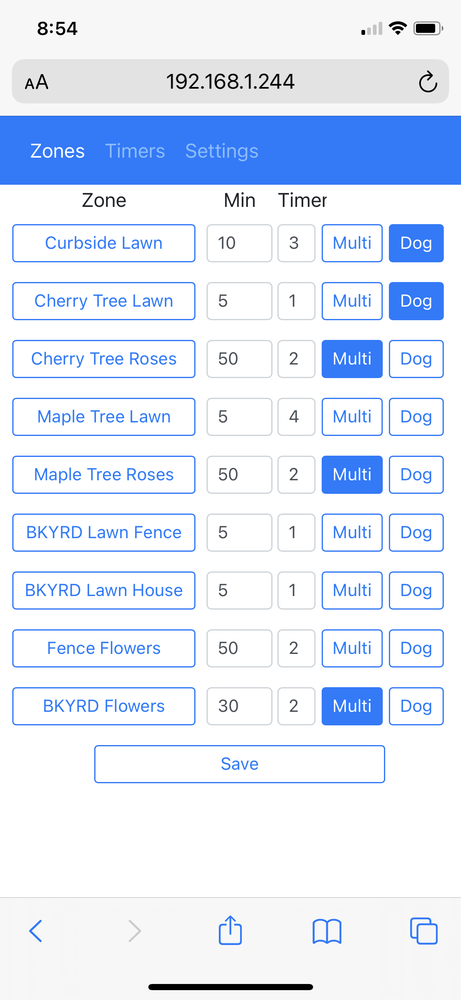
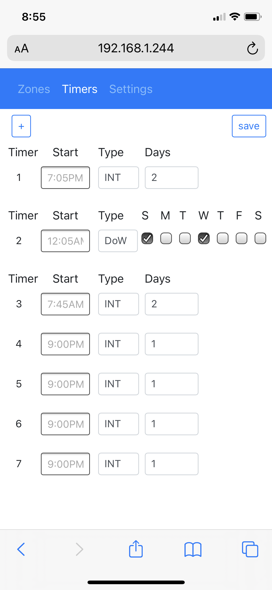
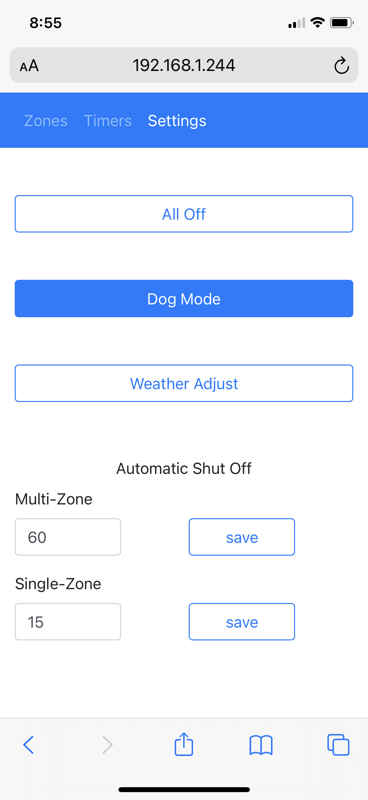
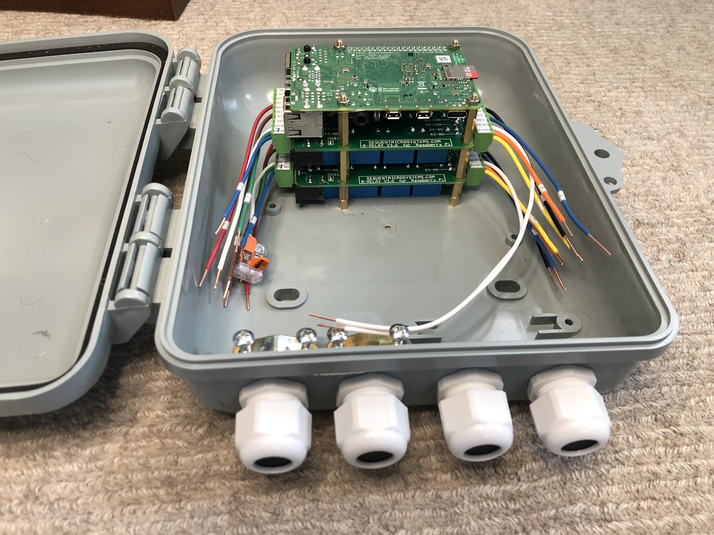
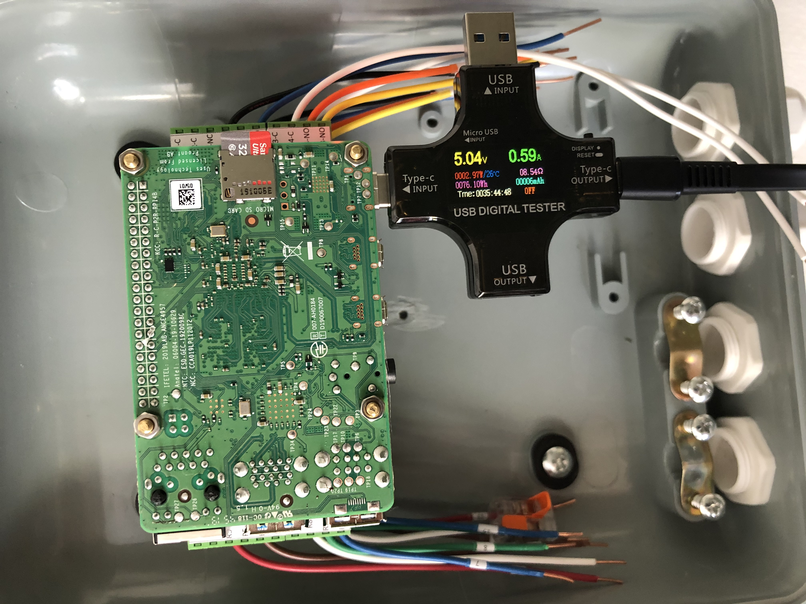
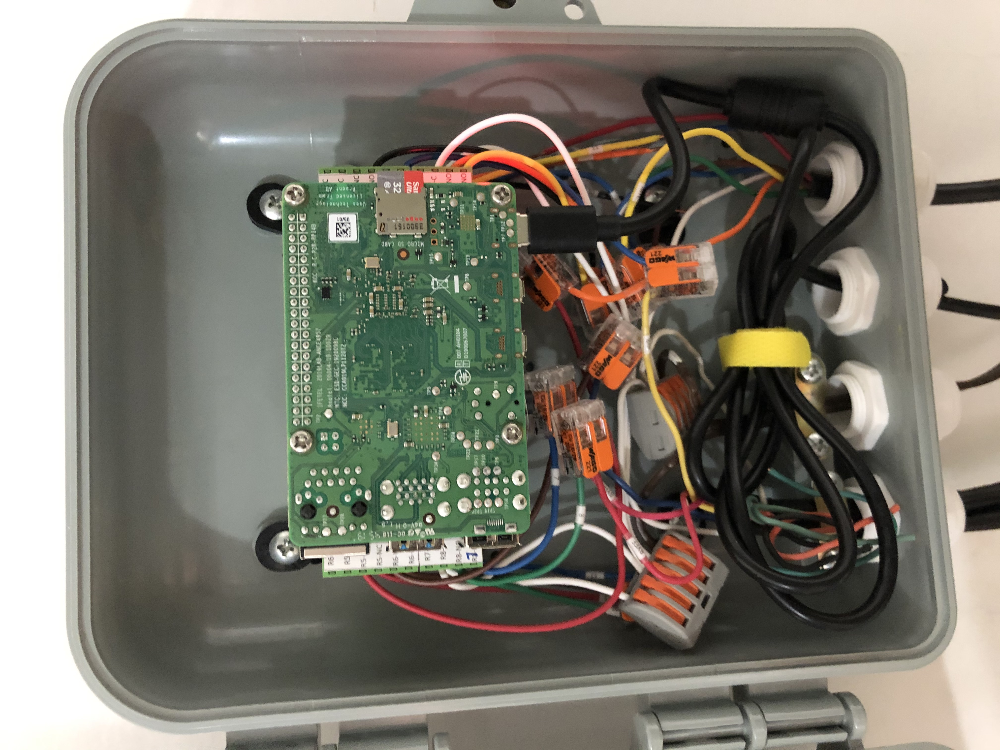

SprinklerController - Raspberry Pi Flask Bootstrap 4 implementation
===================================================================

Per Zone Settings                                |  Timer Settings                                 |  System Settings
:-----------------------------------------------:|:-----------------------------------------------:|:------------------------------------------------:
   |  | 

Motivation
----------
The sprinkler controller was developed as part of a larger system which had requirements that would not be met
by existing solutions and to be honest the UX design of most available systems are lacking, and at the least 
not targeting mobile display resolutions.  

[A simulated version with a fully functional GUI can be found here](http://thegacway.com/zones)

Requirements
------------ 
- 9+ Zones, with watering times from 1 to 120 minutes
- 8+ Timers, with the ability to set by days in the week or an interval number of days
- Manual override
- Enable multiple sprinklers to be turned on at the same time
- JSON Server capable of near instantly turning on configurable zones (dog mode)
- Automatic shut off for manually enabled watering (forget feature)
- Robust, must survive power outages and software lock up
- Remain cool enough to operate in a dust proof enclosure (near zero air circulation)

Application
------------ 
Sprinkler controller application runs an a Raspberry Pi with a Sequent MicroSystems set of 8-Relay stackable hats, 
one relay per valve (watering zone).  Save the i2c address('s) of the hats, the interface
to the hats is obfuscated in RelayController.py.  This application focuses the functionality of providing a html
based GUI interface suitable for mobile devices, via almost entirely from the bootstrap 4 cascading style sheets
(css) and javascript.  Flask is used as a means to automate the creation of the html, providing a responsive UI
and moving the user input from the server back into python.  The little non-volatile storage required for maintaining
state is done via pickle and storing a configuration file in the file system.  Effort has been made to only store
the file at a low frequency, not every time the user changes a parameter on the GUI.  The system can support up
to 64 zones (limited by HW) and an "unlimited" number of timers.  The system supports manual on / off controls with
an auto-shut off feature that prevents the sprinklers from being accidentally left on for an extended period of time.
The system also supports designating each zone as a lower water demand zone.  These multizones can be overlapped so
they operate simultaneously when on the same timer.  This enables simultaneous watering of a set of drip lines (which often
have watering requirements of 2 hours once a week) to be grouped together.  As an example four zones can be watered at
the same time in 2 hours versus taking 8 hours - this allows for more ideal watering times.  The system will also
automatically handle any collisions from multiple timers ensuring the watering durations will be respected for all
zones even if they collide in time.

Repository
---------- 
The repository contains

- The flask based script, SprinklerControler.py
- A relay controller class & methods, RelayController.py
- Bootstrap 4 css and js files under /static
- Flask / Bootstrap 4 custom html files under /templates
- Sprinkler_Controller_README.txt - instructions for setting up RAMDISK and systemd based init startup - needed for restarting image following watchdog
- Configuration file for enabling the watchdog, sc_config.txt
- Configuration file for script, controls modifications for running in develop / execute versus emulation under wsgi on web server
- FlexPrint.py - wrapper for print functions to be redirected when running under wsgi on web server
- Initial NVM File, sprinklerNVM.pkl
- Simulation/smbus.py - smbus simulator for emulated I2C devices, allowing execution on any python system (removes requirement for Sequent MicroSystems hardware to run / debug.
- Bill of Materials (includes all of the hardware used, including the case)
- ScreenShots - static images of the running ap on an iPhone X

Development Environment Installation (non Raspberry Pi)
------------------------------------------------------
To install on Linux / macOS / Windows platform (assuming you already have python installed): 

1. clone / download the repository
1. modify RAMDISK location, I have it set for /tmp which should work by default on Linux / macOS
1. create your private.py definition file - see definitions with import from private in SprinklerController.py
1. update `GMAIL_SMTP_SERVER  = "smtp.gmail.com"` and `SSL_PORT = 465` in SprinklerController.py for the server
for the `SENDER_EMAIL` you configured in private.py 
1. move smbus.py from Simulation to the same directory with SprinklerController.py
1. run SprinklerController.py
1. browse http://0.0.0.0:5000/zones

To simulate at faster than real time: 

1. In SprinklerController.py, set `DEBUG = True` (Recommended)
1. In SprinklerController.py, set `FAKE_TIME_SCALE = xxx`, where xxx is the time multiple - I successfully used values of 200 to 1600 on a late 2013 MacBook Pro.  At some point the multiplier will break the simulation.

If you choose to modify the GUI contents, or any of the page related data structures, delete the sprinklerNVM.pkl file and SprinklerController.py
will generate a new sprinklerNVM.pkl corresponding to the changes. 

Hardware
-------- 
1. Raspberry Pi4 w/ 2GB RAM and Pi4 compatible AC/DC power supply.  The RAM requirements are between 512MB and 1GB and I believe this could run on any version
that met the memory requirements.  In my use case the Pi access my home network via WiFi, so I value the improved WiFi range in the Pi4.
1. [Sequent MicroSystems set of 8-Relay stackable](https://sequentmicrosystems.com/product/raspberry-pi-relays-stackable-card/) hat(s).  I 
use two hats.  **WARNING** the stand-offs provided with my hats were incorrectly sized and too small.  The through hole solder tabs on the 5V supply input come 
dangerously close to the grounded Ethernet receptacle.  Be careful when stacking the first hat on your Pi.  If you choose to mount the entire system in an 
enclosure you will need additional stand-offs anyway.  **WARNING** the silk screen labels for R1-NO and R1-NC are flipped on the version of the board I received.
1. [Altelix 9x8x3 Polycarbonate ABS Weatherproof Utility Box](https://www.amazon.com/gp/product/B085F3CLDR/ref=ppx_yo_dt_b_search_asin_title?ie=UTF8&psc=1) - remember
you will need space inside the box to accommodate all of the wiring.  I liked this enclosure as it's dust proof, includes plenty of hardware for mounting / securing 
wires as they enter/exit the case.
1. [360 Pcs M3 Male-Female Brass Spacer Standoff & Stainless Steel Screw Nut Assortment Kit](https://www.amazon.com/gp/product/B06Y5TJXY1/ref=ppx_yo_dt_b_asin_title_o00_s00?ie=UTF8&psc=1)

Raspberry Pi
------------ 
I would strongly encourage the use of a visual debugging suite.  The code was originally developed on my MacBook to the point where the GUI functioned.  If 
you plan on modifying the GUI I would start in this model.  When I started developing on the Pi I ran VNC sessions, with PyCharm running locally on the pi.
On a completely separate project (AI running jobs on AWS servers) I became aware of the power of Microsoft Visual Code.  I have never been a fan of Microsoft
as they have regularly disappointed with how they have spent their R&D on the office suite, MS Project, and Windows; however, Microsoft Visual Code is so 
well thought out and so well integrated, I've switched all of my project dev environments over.  The effectiveness of the remote installations and extensions
is truly impressive.  To install this on an Linux / macOS / Windows platform (assuming you already have python installed): 

1. setup / configure the Pi (you will need the IP address)
1. install the clone / download the repository
1. install the Sequent MicroSystems hats, remembering to set the jumpers so they do not share the same i2c address if you are using more than one hat.  Record the i2c addresses.  Sequent MicroSystems provides source that can be compiled to test the interface and display all of the addresses; however, this is far more effort.
1. Set the i2c addresses for the hat(s) in SprinklerController.py, by modifying `relaysStackAddressList = [0x3f, 0x3b]` 
1. create the RAMDISK (instructions in Sprinkler_Controller_README.txt)
1. create your private.py definition file - see definitions with import from private in SprinklerController.py
1. if you were simulating with smbus.py, ensure it is not in the same directory with SprinklerController.py
1. modify sc_config.txt to turn the watchdog off `ENABLE_WATCHDOG=0` or move the file from the SprinklerController.py directory
1. follow the instructions in RelayController.py for verifying and setting the i2c instance connected to the hats
1. run SprinklerController.py
1. browse http://x.x.x.x:5000/zones, where x.x.x.x is the Pi's IP address

Assembly
-------- 
Images of the assembled instance are shown below.  The specifications for the enclosure and the components would leave you to believe the fit would be very tight, possibly 
preventing the door from closing.  I found margin when the appropriate stand off sizes were used.  Power consumption was taken with all of the relays being energized.  The 
power supply for driving the sprinkler valve solenoids is on a separate supply which is switched through the relays and has no measurable impact on power consumption.  I
have intentionally mounted the assembly "upside down", which requires the labels on the terminal blocks to know which IO is which.  This was done to have the antenna for the 
Pi being as far away from the wall as practical.

Stack Up                                |  Power Measurements                                 |  Fully Wired
:-----------------------------------------------:|:-----------------------------------------------:|:------------------------------------------------:
   |  | 

Related Work
------------ 
This application is the second half of the larger project.  The first half is a dog detection system, which incorporates a [Raspberry Pi High Quality HQ Camera](https://www.adafruit.com/product/4561?gclid=Cj0KCQiAtqL-BRC0ARIsAF4K3WEdndUzu2NFAQC9rB6TO4P-AtOJtGmU_vhUxJFenFNWIvQrlOxF84saAlQrEALw_wcB)
a Pi4 w/ 8GB of RAM and code from the DogDetect2 repository to detect dogs in the field of view, sending a JSON message to the Sprinkler Controller app.
  
Dependencies
------------

Package               |Version
----------------------|-----------
Python Version         |3.7.3
json version           |2.0.9
argparse version       |1.1
appdirs    |  1.4.3
asn1crypto    |  0.24.0
astroid    |  2.1.0
asttokens    |  1.1.13
automationhat    |  0.2.0
beautifulsoup4    |  4.7.1
blinker    |  1.4
blinkt    |  0.1.2
buttonshim    |  0.0.2
Cap1xxx    |  0.1.3
certifi    |  2018.8.24
chardet    |  3.0.4
Click    |  7.0
colorama    |  0.3.7
colorzero    |  1.1
cookies    |  2.2.1
cryptography    |  2.6.1
cycler    |  0.10.0
decorator    |  4.3.0
distlib    |  0.3.1
docutils    |  0.14
drumhat    |  0.1.0
entrypoints    |  0.3
envirophat    |  1.0.0
ExplorerHAT    |  0.4.2
filelock    |  3.0.12
Flask    |  1.0.2
fourletterphat    |  0.1.0
gpiozero    |  1.5.1
guizero    |  0.6.0
html5lib    |  1.0.1
idna    |  2.6
importlib-metadata    |  1.7.0
ipykernel    |  4.9.0
ipython    |  5.8.0
ipython-genutils    |  0.2.0
isort    |  4.3.4
itsdangerous    |  0.24
jedi    |  0.13.2
Jinja2    |  2.10
jupyter-client    |  5.2.3
jupyter-core    |  4.4.0
keyring    |  17.1.1
keyrings.alt    |  3.1.1
kiwisolver    |  1.0.1
lazy-object-proxy    |  1.3.1
logilab-common    |  1.4.2
lxml    |  4.3.2
MarkupSafe    |  1.1.0
matplotlib    |  3.0.2
mccabe    |  0.6.1
microdotphat    |  0.2.1
mote    |  0.0.4
motephat    |  0.0.3
mypy    |  0.670
mypy-extensions    |  0.4.1
nudatus    |  0.0.4
numpy    |  1.16.2
oauthlib    |  2.1.0
olefile    |  0.46
opencv-contrib-python    |  4.1.1.26
pantilthat    |  0.0.7
parso    |  0.3.1
pbr    |  5.4.5
pexpect    |  4.6.0
pgzero    |  1.2
phatbeat    |  0.1.1
pianohat    |  0.1.0
picamera    |  1.13
pickleshare    |  0.7.5
picraft    |  1.0
piglow    |  1.2.5
pigpio    |  1.44
Pillow    |  5.4.1
pip    |  20.2.2
prompt-toolkit    |  1.0.15
psutil    |  5.5.1
pycairo    |  1.16.2
pycodestyle    |  2.4.0
pycrypto    |  2.6.1
pyflakes    |  2.0.0
pygame    |  1.9.4.post1
Pygments    |  2.3.1
PyGObject    |  3.30.4
pyinotify    |  0.9.6
PyJWT    |  1.7.0
pylint    |  2.2.2
pyOpenSSL    |  19.0.0
pyparsing    |  2.2.0
pyserial    |  3.4
python-apt    |  1.8.4.1
python-dateutil    |  2.7.3
pyxdg    |  0.25
pyzmq    |  17.1.2
qtconsole    |  4.3.1
rainbowhat    |  0.1.0
requests    |  2.21.0
requests-oauthlib    |  1.0.0
responses    |  0.9.0
roman    |  2.0.0
rope    |  0.18.0
RPi.GPIO    |  0.7.0
RTIMULib    |  7.2.1
scrollphat    |  0.0.7
scrollphathd    |  1.2.1
SecretStorage    |  2.3.1
semver    |  2.0.1
Send2Trash    |  1.5.0
sense-emu    |  1.1
sense-hat    |  2.2.0
setuptools    |  40.8.0
simplegeneric    |  0.8.1
simplejson    |  3.16.0
six    |  1.12.0
skywriter    |  0.0.7
smbus2    |  0.3.0
sn3218    |  1.2.7
soupsieve    |  1.8
spidev    |  3.4
ssh-import-id    |  5.7
stevedore    |  3.2.0
thonny    |  3.2.6
tornado    |  5.1.1
touchphat    |  0.0.1
traitlets    |  4.3.2
twython    |  3.7.0
typed-ast    |  1.3.1
uflash    |  1.2.4
unicornhathd    |  0.0.4
urllib3    |  1.24.1
virtualenv    |  20.0.27
virtualenv-clone    |  0.5.4
virtualenvwrapper    |  4.8.4
wcwidth    |  0.1.7
webencodings    |  0.5.1
Werkzeug    |  0.14.1
wheel    |  0.32.3
wrapt    |  1.10.11
zipp    |  3.1.0

